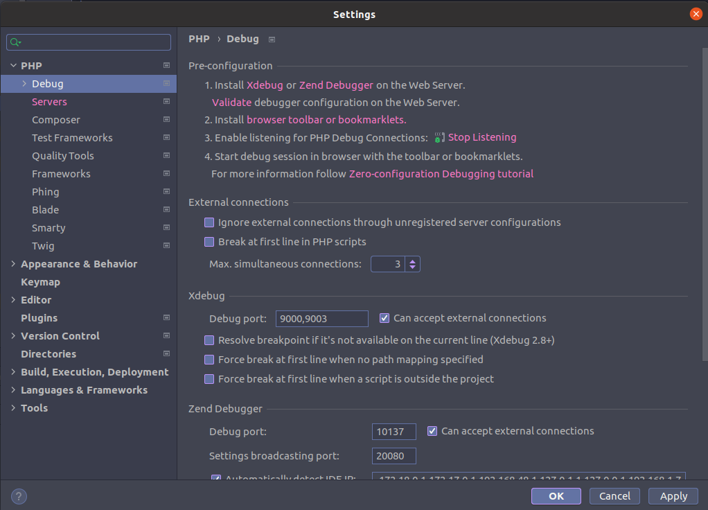

# Docker Magento

Docker magento support

* php:7.4.20
* composer:2.1.3
* mysql:8.0
* elasticsearch:7.13.2
* php myadmin
* blackfire

Docker support php libraries

* bcmath
* ctype
* curl
* dom
* gd
* hash
* iconv
* intl
* mbstring
* openssl
* pdo_mysql
* simplexml
* soap
* spl
* xsl
* zip
* libxml
* xdebug 3
* opache
* apcu
* memcached
* curl

# How to use
## Init project
```bash
mv .env.sample .env

Edit config on the .env file
```

## Create self credentials
```bash
cd /conf/nginx
openssl req -newkey rsa:4096 \
            -x509 \
            -sha256 \
            -days 3650 \
            -nodes \
            -out local.crt \
            -keyout local.key
```

## Start/Stop docker
```bash
docker-compose up -d
docker-compose down -v

```

## Command setup magento
```bash
php bin/magento setup:install --base-url=https://magento.local/ \
--db-host=mysql --db-name=m243cc --db-user=root --db-password=123456 \
--admin-firstname=Dylan --admin-lastname=Ngo --admin-email=it.tinhngo@gmail.com \
--admin-user=admin --admin-password=admin123 --language=vi_VN --currency=VND --timezone=Asia/Ho_Chi_Minh --session-save=db --use-rewrites=1 --use-secure=1 --use-secure-admin=1 --elasticsearch-host=elasticsearch --elasticsearch-port=9200 --search-engine=elasticsearch7 --elasticsearch-index-prefix=pdm --elasticsearch-enable-auth=false  --cleanup-database
```

## Move database to backup folder, It'll help you to import database.

## XDebug config with PhpStorm





Go to mysqladmin: http://localhost:8080
